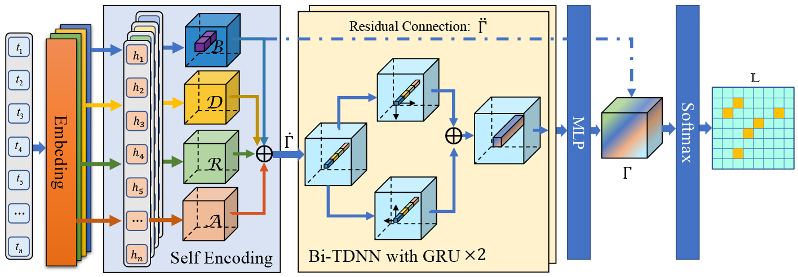

# PlanarizedSentence
Source code for : Planarized Sentence Representation for Nested Named Entity Recognition



**We will upload the code one after another.**

## Installation
### Environment
```bash
python=3.7
pytorch=1.8.0
transformers=4.24.0
gensim=4.2.0
scikit-learn=1.0.2
prettytable=3.5.0
cudatoolkit=11.1
numpy=1.21.5
```

## Dataset
- [ACE 2004](https://catalog.ldc.upenn.edu/LDC2005T09)
- [ACE 2005](https://catalog.ldc.upenn.edu/LDC2006T06)
- [GENIA](http://www.geniaproject.org/genia-corpus)
- [KBP 2017](https://catalog.ldc.upenn.edu/LDC2017D55)
- [NNE](https://aclanthology.org/P19-1510.pdf)
- [CoNLL 2003](https://www.clips.uantwerpen.be/conll2003/ner/)
- [Resume](https://github.com/AAristotle/PlanarizedSentence/tree/main/data/resume-zh)


### Data format
```json
[
  {
  "sentence": 
  ["There", "is", "a", "single", "methionine", "codon-initiated", "open", "reading", "frame", "of", "1,458", "nt", "in", "frame", "with", "a", "homeobox", "and", "a", "CAX", "repeat", ",", "and", "the", "open", "reading", "frame", "is", "predicted", "to", "encode", "a", "protein", "of", "51,659", "daltons."], 
"ner": [
{"index": [16], "type": "DNA"}, 
{"index": [4, 5, 6, 7, 8], "type": "DNA"}, 
{"index": [24, 25, 26], "type": "DNA"}, 
{"index": [19, 20], "type": "DNA"}
        ]
    }
]

```
Due to the license of LDC, we can't directly release our preprocessed datasets of ACE2004, ACE2005, KBP17, and NNE.

## Running the Code
```bash
$ python main.py
```


## References
* Li J, Fei H, Liu J, et al. Unified named entity recognition as word-word relation classification[C]//Proceedings of the AAAI Conference on Artificial Intelligence. 2022, 36(10): 10965-10973.
* Shen Y, Ma X, Tan Z, et al. Locate and Label: A Two-stage Identifier for Nested Named Entity Recognition[C]//Proceedings of the 59th Annual Meeting of the Association for Computational Linguistics and the 11th International Joint Conference on Natural Language Processing (Volume 1: Long Papers). 2021: 2782-2794.
* Chen, Y., Wu, L., Zheng, Q. et al. A Boundary Regression Model for Nested Named Entity Recognition. Cogn Comput (2022). https://doi.org/10.1007/s12559-022-10058-8
